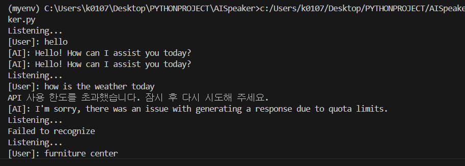

# AI Speaker

## Project Outline
The program uses speech-to-text(STT) to recognize the user's voice.
Then the program interacts with the OpenAI API to acquire the right response for the user's request.
Lastly, the program outputs the answer in a spoken form using a voice file using text-to-speech(TTS).

## Demonstration

## Packages
- SpeechRecognition
- gTTS
- PlaySound
- openai

## User Guide
1. Open the *speaker.py* file and run the program
2. Speaker will welcome the user with a greeting
3. Make a request to the program using your voice
4. The AI speaker will return with a fit response for your request

## Reference Material
유튜브 영상: [인공지능 스피커 만들기 【파이썬】] (https://youtu.be/WTul6LIjIBA?si=PL0MeO2A-8aIGI5g)